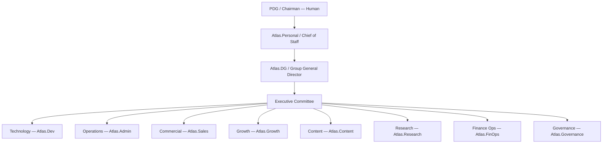
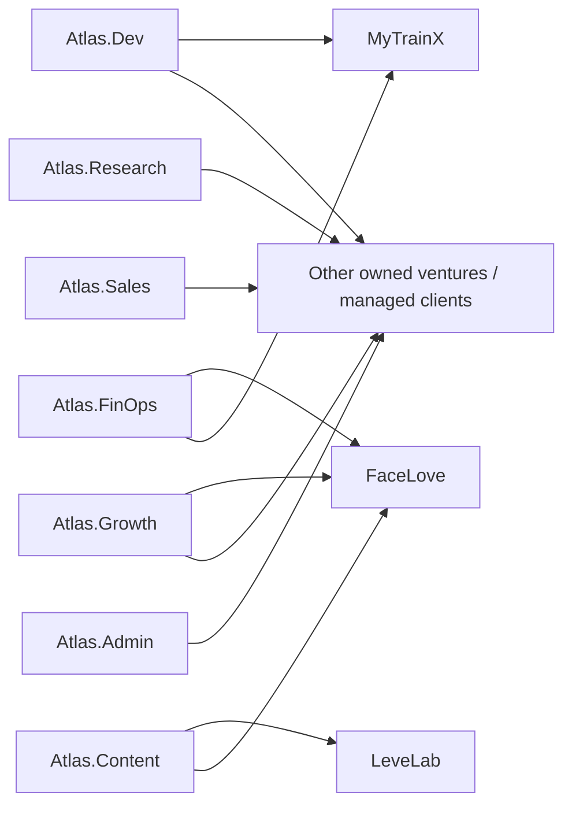
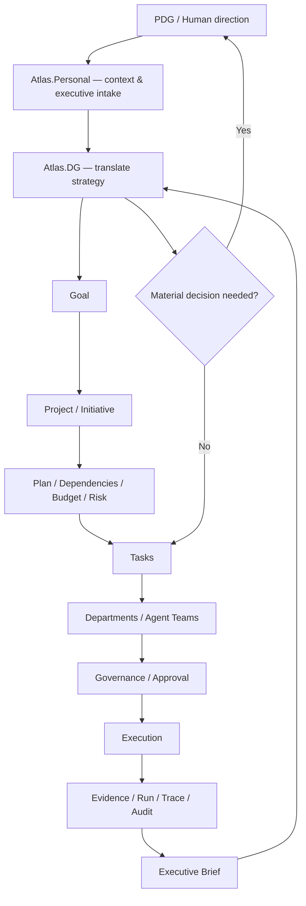
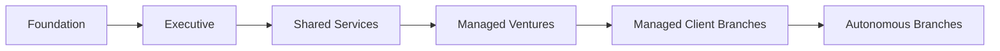

# 21 — Empresa Aumentada Operating System

**Status:** Consolidated operating model  
**Date:** 2026-10-02  
**Scope:** organizational design for the Atlas agentic enterprise

## Purpose

This document consolidates the Group operating model defined across the existing Blueprint into one organizational reference.

It answers:

- who leads the Group;
- what Atlas.Personal and Atlas.DG do;
- which departments exist;
- how shared services support ventures;
- where humans remain accountable;
- how work moves from strategy to execution;
- how autonomy grows without removing governance.

This is an organizational operating model. It does not by itself prove that every role, agent, department or automation is already implemented.

## 1. Core thesis

The objective is an **augmented enterprise** in which humans, AI agents and software systems operate under one durable governance layer.

The founder remains **PDG / Chairman**.

The target is not unrestricted autonomous AI. The target is:

> **high operational leverage under explicit human governance.**

The measurable objective is increased leverage per human decision, not the number of agents.

## 2. Human role

Humans remain accountable for matters with legal, financial, regulatory or irreversible consequences.

Human-only or materially human-governed areas include:

- legal representation;
- material contracts;
- bank and payment authority;
- regulated decisions;
- hiring/firing with legal consequences;
- major capital allocation;
- destructive or irreversible actions;
- constitutional governance changes.

Agents can research, prepare, recommend, coordinate and execute only inside delegated mandates.

## 3. Executive hierarchy



Agent titles are operating roles. They are not legal corporate officer titles unless a human/legal process explicitly establishes that.

## 4. Role of Atlas.Personal

Atlas.Personal is the PDG-facing Chief of Staff interface.

Its organizational purpose is to:

- preserve executive context;
- surface priorities and pending decisions;
- prepare briefing material;
- reduce noise before information reaches the PDG;
- coordinate with Atlas.DG;
- distinguish strategic decisions from routine operational matters.

Atlas.Personal should not silently become the Group operating executor. Atlas.DG owns operational executive coordination.

## 5. Role of Atlas.DG

Atlas.DG is the Group General Director / operational executive agent.

Its purpose is to:

- consume canonical Group state;
- translate strategy into goals and initiatives;
- coordinate projects and departments;
- delegate work;
- follow up execution;
- surface risks, blockers and exceptions;
- prepare executive briefs;
- escalate material decisions to the PDG.

Atlas.DG is not required to be a coding agent or specialist executor.

Its primary function is **management and orchestration**.

## 6. Group structure

Canonical hierarchy:

```text
Organization
  -> Business Unit
      -> Branch / Venture
          -> Team
              -> Agent / Human
```

A branch or venture receives, at minimum:

- mandate;
- objectives;
- budget;
- policies;
- allowed tools;
- service catalog;
- knowledge;
- reporting obligations.

A branch can be:

1. an owned venture;
2. a managed client branch;
3. an internal shared-service unit.

A branch may be logical inside shared infrastructure or physically isolated on dedicated infrastructure.

## 7. Shared-services model

Atlas should avoid duplicating specialist departments inside every venture.

Instead, shared-service departments provide internal services across the portfolio.



Examples already present in the Blueprint:

- Atlas.Content can produce an ebook for LeveLab;
- Atlas.Dev can build a MyTrainX feature;
- Atlas.Growth can operate a FaceLove acquisition campaign;
- Atlas.CX can provide customer service to a venture.

The objective is to create a measurable internal service economy with cost attribution instead of duplicated specialist teams.

## 8. Department mandates

### Atlas.Dev — Technology / Engineering

Mandate:

- software architecture;
- application engineering;
- infrastructure engineering;
- integration engineering;
- testing and technical quality;
- controlled deployment;
- technical documentation;
- engineering security practices.

Atlas.Dev receives objectives from Atlas.DG or the PDG and converts them into technical execution.

### Atlas.Admin — Operations

Mandate:

- shared operations;
- infrastructure administration;
- operational continuity;
- service reliability;
- routine administration;
- deterministic workflows where possible;
- recovery and operational readiness.

### Atlas.Sales — Commercial

Mandate:

- leads;
- opportunity qualification;
- commercial pipeline;
- proposals;
- follow-up;
- CRM discipline;
- coordination of commercial handoffs.

Material external offers, contracts and commitments remain policy-controlled.

### Atlas.Growth — Growth

Mandate:

- acquisition strategy;
- funnel optimization;
- experimentation;
- campaign planning;
- lifecycle growth;
- CRO;
- growth analytics.

### Atlas.Content — Content / Digital Factory

Mandate:

- copy;
- creative production;
- ebooks;
- visual assets;
- landing materials;
- multimedia;
- reusable brand/content systems.

OpenDesign and related specialist runtimes are candidates for later acceleration.

### Atlas.Research — Research / Intelligence

Mandate:

- market research;
- competitive analysis;
- sourcing;
- evidence gathering;
- structured briefs;
- decision support;
- validation of assumptions.

### Atlas.FinOps — Finance Operations

Mandate:

- model/tool cost visibility;
- project and branch cost attribution;
- budget monitoring;
- provider spend;
- unit economics;
- internal service costing;
- margin visibility.

This is operational FinOps, not a replacement for legal accounting.

### Atlas.CX — Customer Experience — roadmap shared service

The roadmap lists Atlas.CX as a later shared-service department.

Expected mandate:

- customer support operations;
- service quality;
- conversation handoff;
- support workflows;
- escalation discipline.

This is a roadmap department, not part of the initial executive committee defined in document 02.

### Atlas.Automation — Automation — roadmap shared service

The roadmap lists Atlas.Automation as a later shared-service department.

Expected mandate:

- deterministic workflow automation;
- n8n/workers;
- repeatable process orchestration;
- reduction of unnecessary LLM usage.

This is a roadmap department, not part of the initial executive committee defined in document 02.

### Atlas.Governance — Governance / Safety

Mandate:

- policy;
- approval classes;
- permissions;
- audit;
- safety controls;
- supply-chain controls;
- agent/tool disablement;
- constitutional guardrails.

Normal agents cannot modify the Atlas Constitution.

## 9. Operational agent classes

The source Blueprint defines executive and departmental agents. The following classification is an **operational extension** to make delegation and workforce planning explicit.

These are reusable role classes, not necessarily permanently running processes.

### Executive Agent

Coordinates organization-level work.

Examples:

- Atlas.DG;
- future branch directors.

### Manager Agent

Owns a team, project or service line inside a defined mandate.

### Planner Agent

Decomposes goals into executable work and dependencies.

### Research Agent

Collects and synthesizes evidence.

### Specialist Agent

Provides domain expertise.

### Builder Agent

Produces artifacts such as code, design, content or configurations.

### Operator Agent

Runs bounded operational procedures and deterministic workflows.

### Reviewer Agent

Performs independent quality, compliance or acceptance review.

### Guardian Agent

Protects governance, permissions, policy and safety boundaries.

### Observer Agent

Reads, monitors and reports without execution authority.

One agent can implement more than one class when scope is small, but separation is preferred when independent review matters.

## 10. Workforce record

Every governed agent should eventually have:

- agent ID;
- role;
- department;
- manager;
- skills;
- tools;
- permission profile;
- model policy;
- budget;
- KPIs;
- current tasks;
- version;
- status;
- evaluation history.

Most agents do not need to remain permanently active. They can be provisioned for a task, team or period and terminate when work is complete.

## 11. Agent Packs

Agent Packs are the versioned operating package for a role.

An Agent Pack should eventually bind:

- role;
- instructions;
- department/team;
- model policy;
- skills;
- allowed tools;
- permission constraints;
- approved knowledge;
- budget;
- KPIs/evaluation expectations;
- governance rules;
- version and review state.

Current Runtime V2 already implements versioned Agent Packs, tool permissions and assignments. Some deeper automatic runtime consumption remains a later implementation concern.

## 12. Autonomy levels

The canonical autonomy ladder is:

### L1 — Observe

Read and analyze only.

### L2 — Recommend

Prepare plans and proposed actions for approval.

### L3 — Execute bounded

Execute approved classes of actions within explicit limits.

### L4 — Manage

Manage a unit, service or portfolio area within budget and policy.

### L5 — Autonomous branch

Plan, delegate and operate a branch within a constitutional mandate.

L5 does not remove material escalation. Human accountability remains for legal, financial, regulated and irreversible matters.

## 13. Work model

Material initiatives should have:

- goal;
- owner;
- budget;
- success criteria;
- dependencies;
- risk level;
- current state;
- evidence;
- next decision.

Board-level or material decisions should leave a durable record:

- proposal;
- analysis;
- alternatives;
- risks;
- decision;
- approving human where required;
- budget;
- deadline;
- later outcome.

## 14. Operating loop



The desired end-state is that routine work circulates below the PDG, while the PDG receives decisions, exceptions and material escalations.

## 15. Deterministic work versus agent work

Not every task should use an LLM.

Preferred rule:

```text
Task
 -> deterministic?
      -> yes: workflow / worker / API / script
      -> no: governed agent
```

n8n, workers and deterministic services should handle repeatable workflows where practical.

## 16. Model policy

The current operating policy is:

**Free-First / Premium-on-Demand.**

Typical direction:

- Atlas.Admin: free-only/free-first;
- Atlas.Research: free-first;
- Atlas.Content: free-first;
- Atlas.Dev: free-first with premium fallback for difficult engineering;
- Atlas.DG: free-first with premium fallback for strategic synthesis;
- critical security/financial review: quality-first or critical.

Model selection is a policy decision, not part of agent identity.

## 17. Governance principles

The governing principle is:

> **Full capability does not mean full authority.**

Illustrative policy:

```text
Create feature branch              allowed
Commit to feature branch           allowed
Open PR                            allowed
Merge main                         policy / approval
Deploy staging                     allowed by policy
Deploy production                  policy / approval
Read production DB                 scoped
Write production DB                approval
Drop database                      forbidden
Send material commercial offer     policy
Sign legal contract                human only
Execute material payment           human / financial control
```

## 18. Critical trust boundaries

Payment-sensitive systems such as XPAYMENTS remain outside the general Atlas agent trust domain.

No default agent receives unrestricted:

- root authority;
- Docker authority;
- database authority;
- payment authority;
- production mutation authority.

## 19. Portfolio forms

The Group can operate three broad entity types.

### Internal shared services

Examples:

- Dev;
- Content;
- Growth;
- CX;
- Research;
- Admin;
- Finance Ops.

### External managed-service branches

Dedicated operations for clients under tenant isolation, dedicated knowledge, channels, budget and service obligations.

### Owned ventures

Products and businesses created, tested and scaled by Atlas.

## 20. Organizational maturity path



### Foundation

Canonical organization, portfolio, Runtime, approvals, knowledge and audit.

### Executive

Atlas.DG, executive brief, decision queue and delegation.

### Shared Services

Specialist departments with service catalogs, Agent Packs, cost models and SLAs.

### Managed Ventures

Shared departments operate owned businesses through projects and service requests.

### Managed Client Branches

Dedicated branches with isolation, onboarding, knowledge, channels and billing/unit economics.

### Autonomous Branches

Higher-autonomy management inside constitutional limits, with material decisions escalated.

## 21. Current implementation relation

The Blueprint operating model is broader than the current implementation.

As of the Runtime V2 architecture work:

- Group OS foundations are implemented in the Atendimento.Center backend;
- Runtime V2 is implemented;
- ToolRegistry / PolicyEngine / ApprovalEngine are implemented;
- Agent Packs are implemented;
- Executive brief and delegation exist;
- delegation creates canonical work but does not yet automatically launch an agent job;
- the complete department workforce is not yet provisioned;
- the Executive Cockpit remains a later phase;
- shared-service departments remain a roadmap phase.

Therefore this document defines the **organizational operating system to implement**, while the technical current-state repository documents what is already implemented and validated.

## 22. Related documents

Foundation sources:

- 00 — Vision
- 01 — Technical Architecture
- 02 — Organization & Operating Model
- 03 — Agent Engine, Skills & Specialist Runtimes
- 04 — Model Routing & FinOps
- 05 — Security & Governance
- 06 — Infrastructure & Portfolio Reset
- 07 — Monetization & Business Model
- 08 — First Agent Bootstrap
- 09 — Roadmap
- 19 — Architecture Freeze
- 20 — Runtime V2 Contract

Companion operating documents:

- 22 — Agent Roles, Responsibilities & RACI
- 23 — Agent Lifecycle, Autonomy & Governance
- 24 — Business Mission Execution Flow
