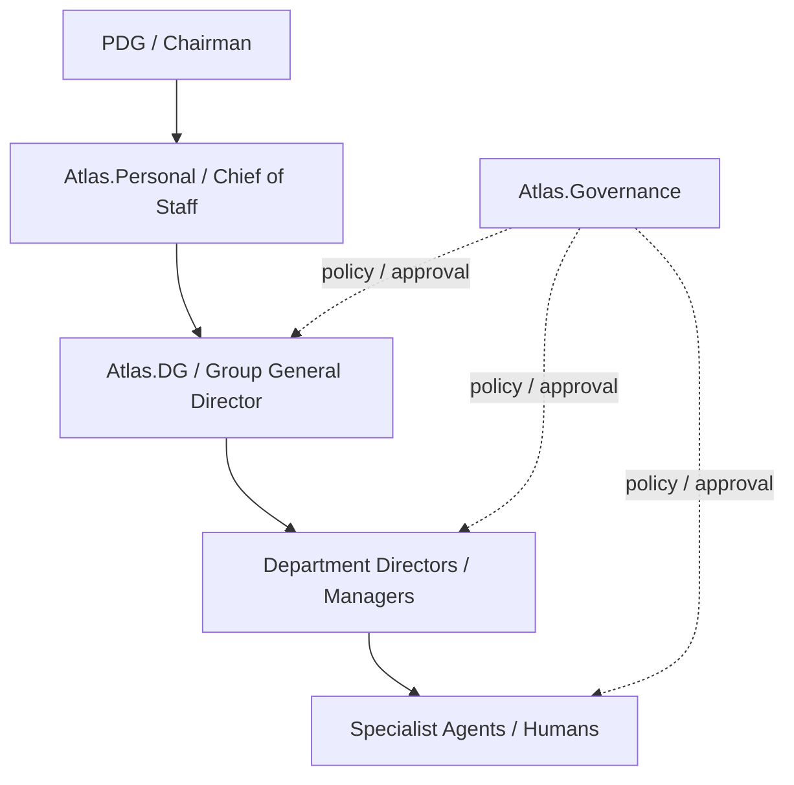
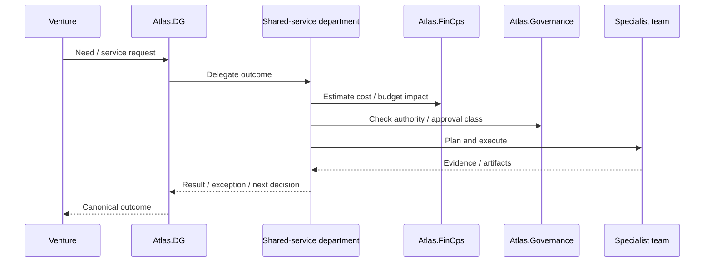

# 22 — Agent Roles, Responsibilities & RACI

**Status:** Operating responsibility model  
**Date:** 2026-10-02

## Purpose

This document makes the organizational responsibilities of the augmented enterprise explicit.

The existing Blueprint defines the executive chain, departments and governance model. This document consolidates those responsibilities and adds an operational RACI layer so that work can be delegated consistently.

Where the original Blueprint did not define a detailed role decomposition, this document labels the additional structure as an **operational extension**.

## 1. Executive responsibility chain



## 2. Role definitions

### PDG / Chairman — Human

Accountable for:

- Group strategic direction;
- major capital allocation;
- constitutional governance;
- material contracts;
- legal representation;
- irreversible/destructive decisions;
- regulated decisions;
- material payment authority.

Should not become the operational bottleneck for routine execution.

### Atlas.Personal / Chief of Staff

Responsible for:

- executive intake;
- maintaining PDG context;
- briefing;
- prioritization support;
- consolidating pending decisions;
- coordinating the interface between PDG and Atlas.DG.

Not the default executor of departmental work.

### Atlas.DG / Group General Director

Responsible for:

- turning strategy into goals;
- portfolio coordination;
- cross-department delegation;
- follow-up;
- executive brief;
- exception management;
- surfacing decisions requiring PDG attention.

### Atlas.Dev

Responsible for:

- technical architecture;
- software engineering;
- integration work;
- infrastructure engineering;
- technical QA;
- controlled deployment;
- technical documentation.

### Atlas.Admin

Responsible for:

- routine operations;
- infrastructure administration;
- reliability;
- shared operational procedures;
- service continuity;
- recovery readiness;
- deterministic operations.

### Atlas.Sales

Responsible for:

- lead and opportunity handling;
- CRM discipline;
- sales follow-up;
- proposals within policy;
- commercial handoffs.

### Atlas.Growth

Responsible for:

- acquisition;
- funnel strategy;
- CRO;
- experiments;
- campaigns;
- lifecycle growth.

### Atlas.Content

Responsible for:

- written content;
- visual assets;
- ebooks;
- creative production;
- digital factory deliverables.

### Atlas.Research

Responsible for:

- market intelligence;
- evidence gathering;
- competitive research;
- source analysis;
- structured research briefs.

### Atlas.FinOps

Responsible for:

- budgets;
- model/tool spend visibility;
- cost attribution;
- unit economics;
- provider cost review;
- margin visibility.

### Atlas.Governance

Responsible for:

- policy;
- approval classes;
- permissions;
- audit;
- supply-chain safety;
- constitutional enforcement;
- emergency disablement.

## 3. Operational agent classes

Operational extension:

| Agent class | Core purpose |
|---|---|
| Executive | Organization-level coordination |
| Manager | Team/project/service management |
| Planner | Goal decomposition and dependency planning |
| Researcher | Evidence gathering and synthesis |
| Specialist | Domain expertise |
| Builder | Produces code/design/content/configuration |
| Operator | Runs bounded operational procedures |
| Reviewer | Independent QA/acceptance/compliance |
| Guardian | Governance/security/policy |
| Observer | Read-only monitoring and reporting |

## 4. Department decomposition

The following is an operational extension designed to support later Agent Packs and team composition.

### Atlas.Dev

```text
Atlas.Dev
├── Dev Manager
├── Software Architect
├── Backend Engineer
├── Frontend Engineer
├── Integration Engineer
├── DevOps / SRE
├── QA / Test Reviewer
├── Security Reviewer
└── Technical Documentation Agent
```

Small projects may combine roles. Independent reviewer roles should remain separate when risk is material.

### Atlas.Admin

```text
Atlas.Admin
├── Operations Manager
├── Infrastructure Operator
├── Reliability / Recovery Operator
├── Automation Operator
└── Service Desk / Admin Specialist
```

### Atlas.Research

```text
Atlas.Research
├── Research Manager
├── Market Researcher
├── Competitive Intelligence Agent
├── Source / Evidence Analyst
└── Research Reviewer
```

### Atlas.Content

```text
Atlas.Content
├── Content Manager
├── Copywriter
├── Editorial Agent
├── Visual / Design Agent
├── Video / Motion Agent
└── Brand / Quality Reviewer
```

### Atlas.Growth

```text
Atlas.Growth
├── Growth Manager
├── Funnel Strategist
├── Paid Acquisition Specialist
├── CRO / Experimentation Agent
├── Lifecycle Agent
└── Analytics Reviewer
```

### Atlas.Sales

```text
Atlas.Sales
├── Sales Manager
├── Lead Qualification Agent
├── Proposal Agent
├── Follow-up Agent
├── CRM Operator
└── Commercial Reviewer
```

### Atlas.FinOps

```text
Atlas.FinOps
├── FinOps Manager
├── Budget Analyst
├── Usage / Provider Cost Analyst
├── Unit Economics Analyst
└── Cost Control Reviewer
```

### Atlas.Governance

```text
Atlas.Governance
├── Governance Manager
├── Policy Guardian
├── Permission Reviewer
├── Security Reviewer
├── Supply-chain Reviewer
└── Audit / Evidence Agent
```

## 5. RACI legend

- **R — Responsible:** performs the work.
- **A — Accountable:** owns the final business outcome or approval.
- **C — Consulted:** contributes expertise.
- **I — Informed:** receives status/evidence.

RACI does not override policy. A role can be Responsible but still require governance or human approval.

## 6. Executive RACI

| Activity | PDG | Atlas.Personal | Atlas.DG | Governance | FinOps |
|---|---|---|---|---|---|
| Group strategy | A | C | R | C | C |
| Strategic portfolio proposal | A | C | R | C | C |
| Routine portfolio coordination | I | I | A/R | C | C |
| Material capital allocation | A/R | C | C | C | R/C |
| Executive brief preparation | I | R/C | A/R | C | C |
| Constitutional policy change | A | C | C | R/C | C |
| Material risk escalation | A | C | R | R/C | C |
| Emergency stop | A | I | C | R | I |

## 7. Project lifecycle RACI

| Stage | Atlas.DG | Research | FinOps | Dev/Admin/Content/Growth/Sales | Governance | PDG |
|---|---|---|---|---|---|---|
| Need / opportunity intake | A/R | C | C | C | I | I/A if strategic |
| Research | A | R | C | C | I | I |
| Feasibility | A | R/C | R/C | R/C | C | I |
| Plan / decomposition | A/R | C | C | R/C | C | I |
| Budget proposal | A | C | R | C | C | A if material |
| Execution | A | C | C | R | C | I |
| QA / review | A | C | C | R/C | R/C | I |
| Material approval | C | I | C | C | R/C | A/R |
| Completion / brief | A/R | C | C | C | C | I |
| Stop / pivot | R | C | C | C | C | A if material |

## 8. Engineering RACI

| Activity | Atlas.DG | Atlas.Dev | Governance | FinOps | PDG |
|---|---|---|---|---|---|
| Technical objective | A | R | C | C | I |
| Architecture proposal | C | A/R | C | C | I |
| Feature branch / implementation | I | A/R | I | I | I |
| Technical review | I | A/R | C | I | I |
| Staging deploy | I | R | C | I | I |
| Production deploy | I | R | A/C per policy | I | A when material/policy requires |
| Production DB write | I | R | A/C | I | A when material |
| Destructive DB action | I | C | R/C | I | A; may be forbidden |
| Incident response | A | R | R/C | C | I/A if material |

## 9. Commercial / growth RACI

| Activity | Atlas.DG | Sales | Growth | Content | FinOps | Governance | PDG |
|---|---|---|---|---|---|---|---|
| Market opportunity | A | C | C | I | C | I | I |
| Lead pipeline | I | A/R | C | I | I | I | I |
| Funnel strategy | A | C | R | C | C | I | I |
| Paid campaign | A | C | R | R/C | C | C | I/A above budget |
| Commercial proposal | A | R | C | C | C | C | I/A if material |
| Legal/material commitment | C | C | I | I | C | C | A/R |
| Campaign budget change | A | I | R | I | R/C | C | A if threshold exceeded |

## 10. Internal shared-service request



## 11. Who should not do what

### Atlas.DG should not

- act as the default coding agent;
- bypass department ownership;
- directly execute unrestricted production changes;
- approve its own material exceptions.

### Specialist agents should not

- redefine Group policy;
- grant themselves tools;
- alter their own approval class;
- bypass project/tenant boundaries;
- claim execution without evidence.

### Governance should not

- silently become the business decision-maker;
- optimize business outcomes by overriding PDG strategy;
- approve actions outside defined authority.

### PDG should not need to

- manually dispatch every routine task;
- repeatedly reconstruct project state;
- review low-risk work already inside approved policy.

## 12. Agent-to-agent delegation rule

Delegation should carry:

- organization;
- business unit / branch;
- project;
- goal/task;
- requested outcome;
- success criteria;
- priority;
- risk;
- budget/cost constraint;
- deadline;
- allowed tools/capabilities;
- required evidence;
- escalation policy.

A delegated agent should receive enough context to execute without receiving unnecessary authority.

## 13. Current implementation relation

Current Runtime V2 already supports:

- durable runs;
- tools;
- policy decisions;
- human approvals;
- tool grants;
- Agent Pack assignment;
- organization/project state;
- executive brief;
- executive delegation into canonical tasks.

The detailed team decomposition and full RACI in this document are operating-model extensions to be reflected progressively in Agent Packs, service catalogs and orchestration.
