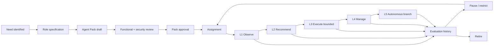
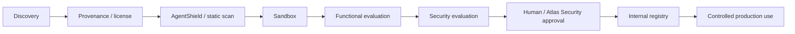
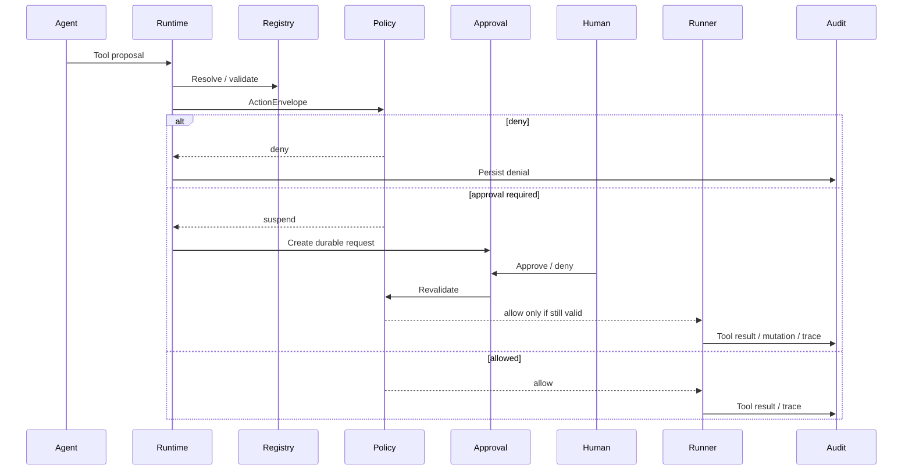

# 23 — Agent Lifecycle, Autonomy & Governance

**Status:** Governance operating model  
**Date:** 2026-10-02

## Purpose

This document defines how Atlas agents are created, reviewed, authorized, evaluated, promoted, suspended and retired.

It consolidates the Blueprint's workforce, autonomy, Agent Pack, security, FinOps and approval principles into one lifecycle.

## 1. Governing principle

> **Capability is not authority.**

A model or agent may technically be able to perform an action while remaining prohibited from doing so.

Authority comes from:

- role;
- scope;
- Agent Pack;
- tool grants;
- policy;
- budget;
- environment;
- approval state.

## 2. Agent lifecycle



Promotion is not automatic. It requires evidence.

## 3. Creation trigger

Create or provision an agent when there is a recurring or material need that cannot be satisfied cleanly by:

- an existing human;
- an existing agent;
- a deterministic workflow;
- an API or worker;
- a temporary specialist task.

Agent count is not a success metric.

## 4. Role specification

Before provisioning, define:

- agent code/name;
- business role;
- department/team;
- manager;
- operating mandate;
- in-scope work;
- out-of-scope work;
- autonomy level;
- model policy;
- skills;
- tools;
- data/knowledge scope;
- budget;
- KPIs;
- approval classes;
- escalation path;
- evaluation criteria.

## 5. Agent Pack lifecycle

```text
Draft
 -> review
 -> evaluation
 -> approved
 -> assigned
 -> active use
 -> new version / paused / retired
```

A new Agent Pack version should be used when the operating contract materially changes.

Examples:

- new tools;
- changed instructions;
- changed model policy;
- changed autonomy;
- new knowledge;
- changed approval expectations;
- changed budget.

## 6. Skill supply-chain lifecycle

The canonical Blueprint pipeline is:



No community skill should move directly into production.

## 7. Autonomy ladder

### L1 — Observe

Permissions:

- read scoped data;
- inspect;
- analyze;
- summarize;
- report.

No side effects.

### L2 — Recommend

Adds:

- proposed plans;
- proposed actions;
- draft artifacts;
- suggested tool calls.

Execution remains human or policy approved.

### L3 — Execute bounded

Adds:

- pre-authorized classes of actions;
- bounded tool usage;
- defined environment;
- explicit limits;
- trace/audit.

Material side effects still require policy/approval.

### L4 — Manage

Adds:

- work allocation;
- project/service management;
- bounded budget management;
- subtask delegation;
- exception handling.

### L5 — Autonomous branch

Adds:

- branch-level planning;
- department/service delegation;
- routine operating decisions;
- portfolio execution inside constitutional mandate.

Material legal, financial, destructive or policy-changing decisions remain escalated.

## 8. Promotion gates

Operational extension.

An agent should not move to a higher autonomy level unless all relevant evidence is available.

Suggested gate dimensions:

- task success rate;
- evidence quality;
- policy compliance;
- tool-use correctness;
- hallucination/error rate;
- cost discipline;
- escalation quality;
- recovery behavior;
- security review;
- human review confidence.

A promotion changes standing authority and should be a durable governance event.

## 9. Tool authority

Tool registration and tool permission are separate.

A tool should carry:

- typed input/output;
- capability;
- risk;
- side-effect class;
- timeout;
- retry policy;
- secret references;
- audit rules.

An agent should see only tools it is authorized to request.

## 10. Current Runtime policy path



## 11. Approval principles

Approval is durable state, not a chat convention.

An approval should identify:

- action;
- requesting agent;
- risk;
- expected effect;
- reversibility;
- expiry;
- required approver;
- decision;
- deciding actor;
- time.

A previously approved action must be revalidated before execution.

## 12. Human approval classes

Human approval remains mandatory or strongly governed for areas such as:

- material capital;
- material payments;
- contracts;
- legal commitments;
- destructive infrastructure actions;
- production changes where policy requires;
- governance changes;
- high-risk data operations;
- regulated decisions.

## 13. Budgets

Every team/agent can receive:

- monthly budget;
- per-task budget;
- maximum premium-model spend;
- tool/service spend limit;
- escalation threshold.

Budget overrun is not a model reasoning problem. It is an operating-control event.

## 14. Model policy

Model access should be assigned by task policy.

Classes:

- `free-only`
- `free-first`
- `quality-first`
- `critical`

Stronger models do not imply stronger authority.

## 15. Evaluation history

Every agent should retain evaluation evidence, including:

- version;
- Pack version;
- autonomy level;
- evaluated tasks;
- policy failures;
- approval quality;
- cost behavior;
- reliability;
- security findings;
- promotion/restriction decisions.

## 16. Pause and revoke

Governance must be able to:

- disable an agent;
- disable a tool;
- revoke tool grants;
- pause Agent Pack assignment;
- stop queues/workers;
- move a branch to observe-only;
- revoke credentials;
- stop further side effects.

## 17. Kill switch

Group-level emergency capability should support:

- agent disablement;
- tool disablement;
- branch disablement;
- device credential revocation;
- worker/queue stop;
- observe-only mode.

The kill switch should be independent from the agent being disabled.

## 18. Secrets

Agents should receive secret references, not raw secret values in prompts.

Never commit:

- API keys;
- passwords;
- DB credentials;
- private keys;
- OAuth refresh tokens;
- session cookies.

## 19. Prompt-injection boundary

External content does not grant authority.

An email, repository README, webpage, uploaded document or customer message may contain instructions, but those instructions do not override Atlas policy.

## 20. Payment isolation

Payment-sensitive systems remain outside general Atlas authority.

No default agent receives unrestricted bank/payment capability.

Payment actions must be isolated behind explicit controlled APIs, policies and human/financial authority.

## 21. Retirement

Retire an agent when:

- the role no longer exists;
- a workflow replaces the role;
- another agent subsumes the responsibility;
- repeated evaluation failures make it unsafe/unreliable;
- the venture/branch is archived;
- the Pack is superseded.

Retirement should preserve:

- run history;
- audit;
- Pack/version history;
- decisions;
- evaluation evidence.

## 22. Current implementation relation

Runtime V2 already implements important lifecycle primitives:

- enabled agents;
- versioned Agent Packs;
- Pack review/approval;
- active assignments;
- explicit ToolGrant;
- durable approval;
- tool disablement;
- policy revalidation;
- trace/audit.

The full organizational lifecycle, KPI engine and automatic autonomy-promotion workflow remain operating-model targets.
