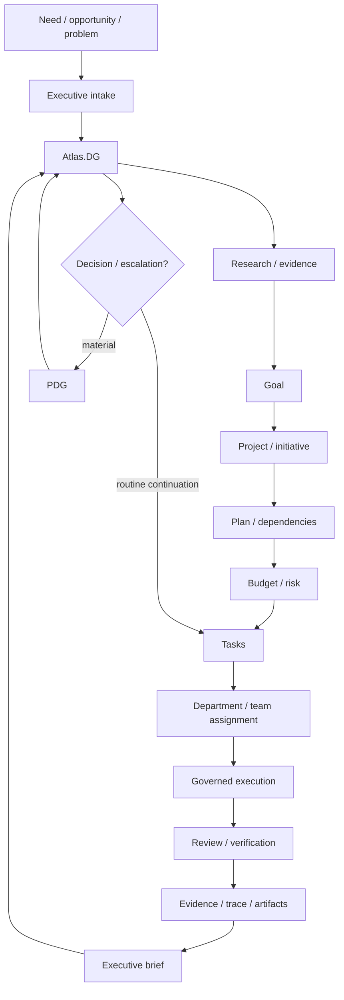
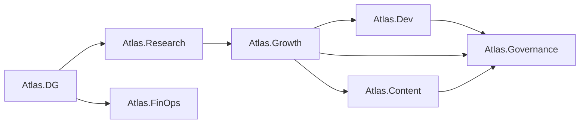
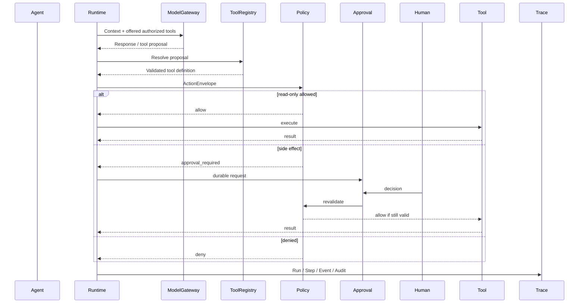
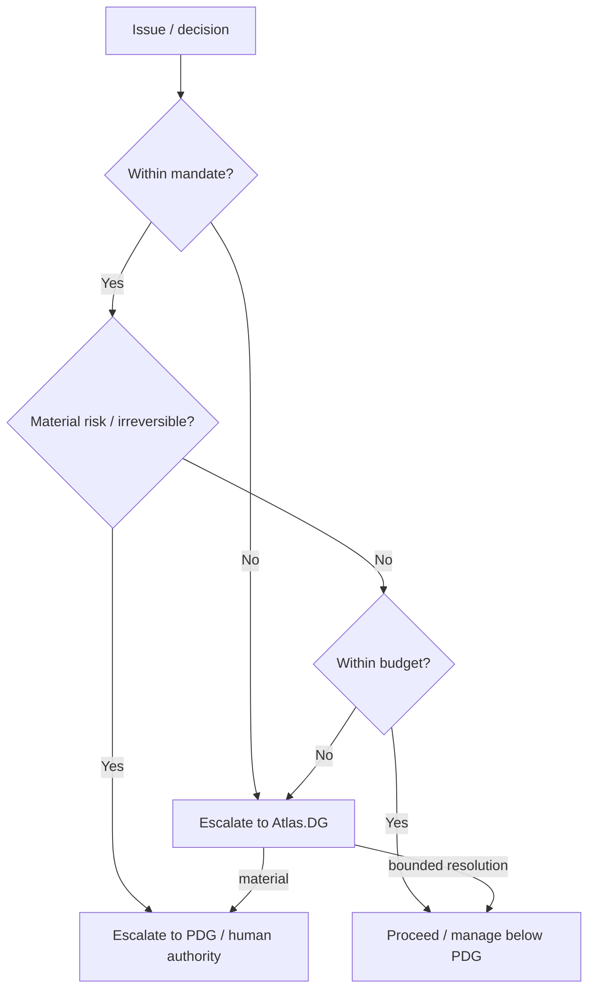

# 24 — Business Mission Execution Flow

**Status:** Canonical mission operating flow  
**Date:** 2026-10-02

## Purpose

This document defines how business intent should move through the augmented enterprise from human direction to governed execution and executive reporting.

It connects:

- PDG;
- Atlas.Personal;
- Atlas.DG;
- goals/projects/tasks;
- shared-service departments;
- specialist agents;
- FinOps;
- Governance;
- Runtime;
- evidence;
- executive brief.

## 1. Mission lifecycle



## 2. Mission intake

A mission can originate from:

- PDG request;
- Atlas.Personal executive intake;
- Atlas.DG portfolio review;
- branch/venture request;
- operational incident;
- KPI deviation;
- customer/client request;
- scheduled review;
- system signal or event.

The source does not determine authority. Policy still applies.

## 3. Intake record

A material mission should capture:

- requesting actor;
- organization/branch;
- desired outcome;
- business reason;
- urgency;
- initial risk;
- constraints;
- known budget;
- evidence/source;
- decision deadline.

## 4. Atlas.Personal intake

When the mission comes from the PDG, Atlas.Personal should:

- clarify executive context;
- attach relevant prior decisions;
- identify urgency;
- distinguish information request from execution request;
- forward operational work to Atlas.DG;
- retain only genuinely executive follow-up for the PDG.

## 5. Atlas.DG triage

Atlas.DG determines whether the request is:

- simple information;
- deterministic workflow;
- research task;
- project;
- cross-department mission;
- decision request;
- incident;
- branch-level operating matter.

Atlas.DG should avoid turning every request into a large project.

## 6. Research and evidence

When material uncertainty exists, Atlas.Research should gather evidence before planning.

Research output should include:

- question;
- sources;
- findings;
- confidence/limitations;
- alternatives;
- unresolved unknowns;
- recommended next decision.

Research should not silently become execution.

## 7. Goal creation

A goal should define:

- desired business outcome;
- owner;
- success criteria;
- time horizon;
- risk;
- budget context;
- evidence required for completion.

## 8. Project / initiative creation

Create a project when the goal requires coordinated work across multiple tasks, people, agents, tools or departments.

Project fields should include:

- objective;
- owner;
- success criteria;
- dependencies;
- risk;
- budget;
- status;
- evidence;
- next decision.

## 9. Planning

Planning should answer:

- what must be delivered;
- by whom;
- in what sequence;
- with which dependencies;
- at what cost;
- using which tools;
- with which approval gates;
- with what acceptance criteria.

## 10. Department selection

Suggested routing:

| Need | Primary department |
|---|---|
| Software / integration / technical build | Atlas.Dev |
| Infrastructure / operations / reliability | Atlas.Admin |
| Market / evidence / sourcing | Atlas.Research |
| Content / creative / editorial | Atlas.Content |
| Acquisition / funnel / CRO | Atlas.Growth |
| Leads / CRM / proposals | Atlas.Sales |
| Cost / budget / unit economics | Atlas.FinOps |
| Policy / permissions / approval / audit | Atlas.Governance |

Cross-functional missions can have one accountable lead and multiple supporting departments.

## 11. Task decomposition

Tasks should be:

- outcome-oriented;
- assignable;
- bounded;
- evidence-producing;
- explicit about dependencies;
- explicit about risk;
- explicit about completion criteria.

Avoid vague tasks such as “improve project”.

Prefer:

> “Audit checkout flow against current payment integration and deliver a prioritized defect list with evidence.”

## 12. Delegation envelope

Operational extension.

Every agent delegation should carry:

```text
organization
business unit / branch
project
goal/task
requested outcome
success criteria
priority
risk
budget/cost limit
deadline
allowed tools/capabilities
required evidence
approval class
escalation policy
```

## 13. Specialist team composition

A mission team can be assembled dynamically.

Example — new product funnel:



## 14. Deterministic-first rule

Before launching an agent task, ask:

```text
Can this be done safely and reliably by:
- API?
- worker?
- script?
- database query?
- n8n workflow?
- deterministic rule?
```

If yes, prefer deterministic execution.

Agents should add reasoning where reasoning is actually required.

## 15. Runtime execution

Current Runtime architecture:



## 16. Approval gate

A material action may be Responsible to an agent and still require Accountable approval from another role.

Approval should evaluate:

- action;
- risk;
- expected effect;
- reversibility;
- current authorization;
- environment;
- budget;
- human authority where required.

## 17. Review and verification

Execution is not completion.

A mission should produce acceptance evidence.

Depending on task type:

- code tests;
- screenshots;
- API results;
- DB evidence;
- analytics;
- source citations;
- content review;
- budget comparison;
- policy/audit trace.

Reviewer independence increases with risk.

## 18. Mission evidence pack

Operational extension.

For material missions, retain:

- mission/task ID;
- initiating actor;
- assigned team/agents;
- plan;
- approvals;
- Run IDs;
- tool/actions;
- artifacts;
- test/review evidence;
- costs;
- outcome;
- unresolved issues;
- final decision.

## 19. Executive brief

Atlas.DG should not forward raw execution logs to the PDG.

The executive brief should answer:

- what changed;
- whether the objective is on track;
- major blockers;
- cost/budget status;
- risks;
- decisions waiting;
- recommended options;
- evidence links.

## 20. Escalation logic



## 21. First practical Atlas.DG -> Atlas.Dev flow

The current implementation supports the beginning of this loop.

```text
PDG / operator
 -> Atlas Executive / DG surface
 -> create canonical delegated Task
 -> start Atlas.Dev Runtime run
 -> Atlas.Dev reads canonical context
 -> proposes tool
 -> PolicyEngine
 -> approval if side effect
 -> ToolRunner
 -> trace / audit
 -> result
 -> Executive brief
```

Current limitation:

Executive delegation creates the task but does not yet automatically launch the Runtime job.

That automation should be added only after the controlled staging path is validated.

## 22. Example mission — software feature

```text
PDG:
"Improve the checkout conversion of Venture X."

Atlas.DG:
- creates goal;
- requests evidence from Growth/Research;
- creates project;
- sets budget/risk;
- delegates technical task to Atlas.Dev;
- delegates content task to Atlas.Content;
- delegates funnel task to Atlas.Growth.

Atlas.Dev:
- audits implementation;
- proposes changes;
- builds on feature branch;
- tests;
- requests governed staging deployment.

Atlas.Growth:
- defines experiment;
- measures baseline;
- prepares acquisition/CRO plan.

Atlas.Content:
- prepares copy/assets.

Atlas.FinOps:
- records cost/budget impact.

Atlas.Governance:
- enforces deployment/production/financial gates.

Atlas.DG:
- receives evidence;
- continues routine execution;
- escalates only material decision to PDG.
```

## 23. Example mission — research only

```text
PDG:
"Should we enter market X?"

Atlas.Personal:
- attaches executive context.

Atlas.DG:
- delegates research.

Atlas.Research:
- gathers evidence;
- compares options;
- identifies unknowns;
- produces decision brief.

Atlas.FinOps:
- supplies cost assumptions if needed.

Atlas.DG:
- prepares alternatives.

PDG:
- makes strategic decision.

No operational side effect is required.
```

## 24. Example mission — operations incident

```text
Signal / alert
 -> Atlas.Admin
 -> inspect
 -> identify impact
 -> deterministic recovery if pre-authorized
 -> Atlas.Dev if technical remediation required
 -> Governance if elevated permissions required
 -> Atlas.DG if business impact is material
 -> PDG only if threshold / major risk is reached
```

## 25. Mission completion

A mission is complete when:

- success criteria are met or explicitly waived;
- evidence exists;
- artifacts are stored;
- costs are recorded where measurable;
- approvals are linked;
- unresolved items are visible;
- next decision is clear;
- project/task state is canonical.

## 26. Feedback loop

Completed missions should improve:

- Agent Packs;
- service catalogs;
- policies;
- skills;
- runbooks;
- budgets;
- evaluation evidence.

Learning must not silently rewrite constitutional policy or grant new authority.

## 27. Relation to roadmap

This operating flow spans multiple roadmap phases.

Current foundation:

- Group OS;
- Runtime V2;
- approvals;
- Knowledge;
- Agent Packs;
- Executive brief/delegation.

Next major organizational milestone:

- Atlas.DG + Executive Cockpit.

Later:

- full shared-service departments;
- managed client branches;
- higher autonomy;
- swarm/federation only after measurable benefit.
